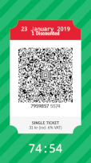

# Stockholm-ticket-art
Stockholm ticket art competition

This is a personal art-project for Stockholm Ticket Art. It is an inofficial, rolling contest by some interested in ticket-art in the Stockholm area.

The purpose is art, and nothing else. This entry is a submission of one individuals (with the unknowing help of others and their skill) artistic intepretation of the Stockholm SL tickets. This may not be used for entering the metro/bus system as it would constitute forgery and is a very serious crime in Sweden.

# In order to view on mobile, Android device: 

download these files as .zip to your computer.

Send to your Android phone, in any way, I use wifi via an app called kdeconnect, but it is easier to email the .zip file to yourself and download it to your phone. 
Next open the Android file manager, navigate to "Downloads" and unzip the Stockholm-ticket-art.zip

Next start your Firefox browser and search for '/' in the search bar. 
It is important that you type only /  that is, the forward slash-symbol and hit search. Firefox will show you your own directory tree.

You must now navigate through the folders: sdcard/Download/Stockholm-ticket-art-contest and in the unzipped directory you will find a file called index.html which you may now click.

You may now enjoy your ticket-art.

# Do not use as fake-ticket in Sweden as it is very illegal and would constitute forgery!

